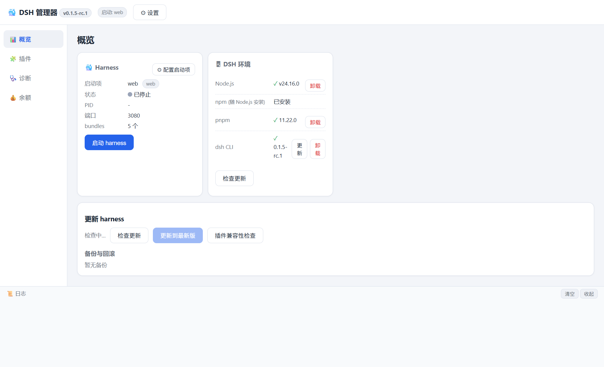
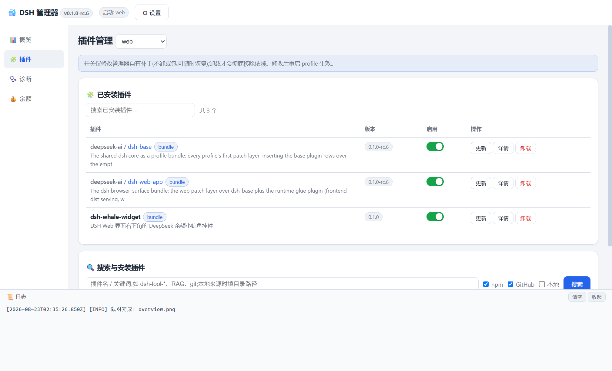
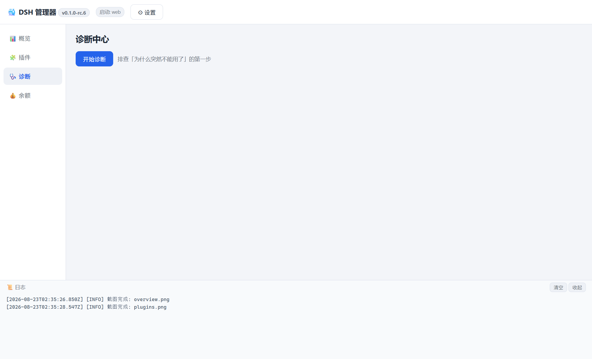

# DeepSeek Harness Manager

**English** · [简体中文](README.zh-CN.md)

> ### The Windows control center for DeepSeek Harness

Launch, manage plugins, diagnose problems, update, and roll back your DSH environment — without living in the command line.

[](https://github.com/sss-1012/DeepSeek-Harness-Manager/releases/latest)
[](https://github.com/sss-1012/DeepSeek-Harness-Manager/releases)
[](https://github.com/sss-1012/DeepSeek-Harness-Manager/actions)
[](https://github.com/sss-1012/DeepSeek-Harness-Manager/stargazers)
[](LICENSE)




> [!IMPORTANT]
> **Upstream moves fast.** This manager targets the current `@deepseek-ai/dsh` CLI (0.1.x).
> DSH is a fast-moving preview: profiles, plugin bundles and the layout plugins are resolved from
> can change between releases. The manager detects what it can, backs up before every update and
> offers a one-click plugin-compatibility repair — but it cannot anticipate every upstream change.
> Keep the automatic backup until you are sure the new version is good.

## Why DSH Manager?

DeepSeek Harness moves fast. Profiles, plugin bundles, dependencies — and the CLI itself — change between releases. Doing all of that by hand in a terminal, and recovering when an update or a plugin goes wrong, is tedious and easy to get wrong.

DSH Manager puts the whole lifecycle in one window:

- **See** whether your Harness is running (status, PID, port) and start or stop it
- **Manage** plugins: install, enable/disable, update, uninstall
- **Check** the environment: Node.js, npm, pnpm, dsh, profiles, plugin resolution, ports
- **Back up before** an update, and **roll back** when an update causes trouble
- **Stay in control** of credentials and file permissions

> DSH changes fast. Plugins break. Updates go wrong.
> DSH Manager helps you **diagnose, recover, and keep the environment manageable** — it does not promise a magic fix.

## Features

| | Pillar | What it gives you |
|---|---|---|
| 🚀 | **Launch & manage** | Harness status, PID and port; start/stop; pick which profile to launch |
| 🧩 | **Plugin management** | Install from npm / GitHub / local, enable or disable without uninstalling, update, uninstall, jump to the plugin's source |
| 🩺 | **Diagnostics** | Environment, profiles, plugin resolution, ports, credentials and permissions — with a Markdown report |
| 🔄 | **Update & rollback** | Version detection, backup before updating, live progress, one-click rollback |
| 🧷 | **Compatibility repair** | After a DSH update, self-check whether your plugins still resolve — and repair in one click |
| 🔐 | **Credentials & permissions** | Windows-encrypted secret storage, plaintext audits, one-click file-permission hardening |

### Full feature list

| Feature | Description |
|---|---|
| Dashboard | Harness status (PID, port), launch/stop, launch settings per profile |
| Environment | Detect and one-click install/uninstall Node.js, npm, pnpm and the dsh CLI |
| Plugin manager | Installed plugin list (search/filter), enable, disable, update, uninstall |
| Plugin sources | npm registry, GitHub repositories, local folders |
| Dependency resolver | Detects plugin dependencies during installation |
| Diagnostics | Node/npm/pnpm/dsh, profile integrity, plugin resolution, port, credentials, file permissions + Markdown report |
| Updates | Detect newer versions, back up, update with live output, roll back to a backup |
| Compatibility | Post-update plugin-resolution self-check with one-click repair |
| Profiles | List profiles, choose the launch target, manage plugins per profile |
| Security | DPAPI-encrypted secrets, plaintext credential audit, ACL hardening |
| Tray & logs | System tray quick actions, live log panel |
| Balance | DeepSeek API balance (optional, Phase 2) |

## Screenshots

### Dashboard — status, environment, updates


### Plugin manager — installed plugins and search/install



### Diagnostics — environment checks, plugin resolution, security audit



<sub>Screenshots are generated from the app itself with `npm run screenshots` (Electron `capturePage`), so they never drift far from the real UI.</sub>

## Download

The easiest way to get started is the latest Windows release:

**[⬇ Download the latest release](https://github.com/sss-1012/DeepSeek-Harness-Manager/releases/latest)**

Two build types are published:

| Build | Best for |
|---|---|
| `DeepSeek-Harness-Manager-<version>-setup.exe` | **Installer** — recommended for normal use. Adds Start-menu and desktop shortcuts, and supports uninstalling. |
| `DeepSeek-Harness-Manager-<version>-portable.exe` | **Portable** — no installation. Handy for testing or running from a USB drive. |

### Requirements

- Windows 10 / 11 (x64)
- DeepSeek Harness (`@deepseek-ai/dsh`), installed globally

You do **not** have to set up the environment by hand: if Node.js or the dsh CLI are missing, the dashboard offers one-click installation.

> Building from source instead? See [docs/DEVELOPMENT.md](docs/DEVELOPMENT.md).

## Companion plugin: open the manager from inside DSH

This repository also ships a small DSH plugin (`plugin/`) that puts a **管理器** pill in the
bottom-left corner of the DSH web UI:

| Pill state | What a click does |
|---|---|
| Green dot — manager found | Launches it. Already running? The existing window comes to the front (single instance). |
| Amber dot — not found | Opens the releases page so you can download it. |

The plugin holds no business logic: three local routes (`/dsh-manager/status.json`,
`/dsh-manager/launch`, `/dsh-manager/panel.js`) and one injected `<script>`. It reads
`install.json` written by the packaged manager, so it always points at the copy you actually run.
If the manager is missing, DSH itself is unaffected.

```bash
# install from this repository (link mode, no npm publish needed)
dsh plugin --profile web add link:/path/to/DeepSeek-Harness-Manager/plugin
# then restart dsh web
dsh plugin --profile web remove dsh-harness-manager   # uninstall
```

The pill can be hidden (× button); the preference is stored in `localStorage`. The plugin locates
the manager through `DSH_MANAGER_EXE`, then `~/.dsh-manager/install.json`, then the usual install
locations — see [plugin/README.md](plugin/README.md) for details, the two self-check commands
(`node plugin/test/host.test.js`, `node plugin/test/boot-check.mjs`) and the awesome-list
submission file. The plugin is **not on npm yet**, so use the `link:` form above.

## Usage

1. **Open the app** — the dashboard shows whether your Harness is running, plus the DSH version and environment status.
2. **Fix the environment if needed** — install missing Node.js / dsh pieces from the dashboard, or press *Check for updates*.
3. **Start the Harness** — press *Start*. Command-line style profiles (for example a custom profile that expects `--probe`) need their launch arguments set in *Launch settings* first.
4. **Manage plugins** — in *Plugins*: search a source, install, then enable/disable with the switch. Disabling never uninstalls: the manager keeps its own patch, so you can flip it back at any time.
5. **After a DSH update** — the manager self-checks plugin resolution and offers a one-click repair if something no longer resolves.
6. **When something breaks** — run *Diagnostics*; it produces a Markdown report you can attach to an issue.

## Security

Credentials handling is deliberately conservative:

- DeepSeek API keys and GitHub tokens are stored with **Windows-backed secure storage** (Electron `safeStorage` / DPAPI). Decryption requires the same Windows account on the same machine.
- If OS-level encryption is unavailable, the manager **refuses to save secrets in plaintext** (fail-closed); any legacy plaintext secret is migrated to encrypted storage at startup.
- Secrets are held by the main process only and are sent only to the official endpoints (`api.deepseek.com`, `api.github.com`). They are not written into logs, runtime history, backups or diagnostic reports.
- Diagnostics audits plaintext credentials and file permissions, and can harden permissions in one click (breaks inheritance, leaving only *current user / SYSTEM / Administrators*).
- The optional **"skip certificate verification for GitHub"** switch is **off by default**; enable it only on networks with TLS interception. It affects GitHub requests only.
- ⚠️ **Heads-up:** DeepSeek Harness itself stores provider keys in plaintext in `~/.dsh/.credentials.yaml`. The manager never writes there, but Diagnostics will warn you about the exposure and offer to tighten the file permissions.

## Troubleshooting

### The Harness will not start

Run **Diagnostics**. The manager extracts the real reason from the boot output, for example:

- *Plugin resolution failure* — `failed to import loader entry …` → press **Plugin compatibility check** in the update panel and repair it. This happens when a new DSH release resolves plugins from a different location.
- *Port already in use* — another Harness instance is still running; stop it or change the monitored port in *Launch settings*.
- `--expose-internals is required for HMR service` — you are on a manager build older than **v0.1.2**; upgrade. (Old builds launched DSH with Electron's bundled Node, which breaks the profile boot.)

### Harness is not detected

The dashboard shows the DSH version it can find. If it is empty, the CLI is not on `PATH` or not installed — use the dashboard's one-click install, or run `npm install -g @deepseek-ai/dsh` yourself.

### Plugin installation fails

- Check that npm/pnpm work in a normal terminal.
- On proxy or TLS-intercepting networks, GitHub search/install may fail with `fetch failed`; the search panel can enable *skip certificate verification* for GitHub, or use the npm / local source instead.
- pnpm must be installed for profile-local installs (`npm install -g pnpm`).

### HTTPS certificate errors while building or downloading

See [docs/TROUBLESHOOTING.md](docs/TROUBLESHOOTING.md) — it covers mirrors, `--use-system-ca` and offline builds.

### Where are the logs?

`~/.dsh-manager/logs/`, plus the built-in log panel at the bottom of the window. Diagnostic reports are written to `~/.dsh-manager/reports/`.

## Architecture

```
┌─ Electron main process (Node.js) ──────────────────────────┐
│  dsh.js        dsh CLI wrapper (launch / stop / version)   │
│  tool.js       npm / pnpm runner (shim resolution)          │
│  profiles.js   profile discovery & metadata                 │
│  plugins/      plugin service + source adapters             │
│  overrides.js  manager-owned enable/disable patch state     │
│  status.js     process supervision & status polling         │
│  update.js     version check / backup / update / rollback   │
│  diagnose.js   diagnostics center                           │
│  env.js        environment detect / install / uninstall     │
│  compat.js     plugin-resolution compatibility + repair     │
│  security.js   credential & file-permission audit           │
│  balance.js    DeepSeek API balance                         │
│  tray.js       system tray                                  │
└───────────────┬─────────────────────────────────────────────┘
                │ IPC (contextBridge, allow-listed API)
┌───────────────▼─────────────────────────────────────────────┐
│ Renderer — plain HTML / CSS / JS, no build step             │
└─────────────────────────────────────────────────────────────┘
```

Design decisions worth knowing:

- **Enable/disable state belongs to the manager.** It is written to `~/.dsh-manager/plugins/<profile>/overrides/state.yml` and injected at launch with `dsh --patch`. The profile's own `cordis.patch.yml` and the plugin packages are never touched, so a DSH update cannot overwrite your state.
- **DSH is launched with the real `node.exe`**, never with Electron's bundled Node — the latter trips the HMR internals check and aborts the profile boot.
- **`.cmd` shims are parsed** to their real JS entry points and executed with Node directly, which avoids Windows shell quoting problems and injection risk.
- **Source adapters** (`src/plugins/sources/{npm,github,local}.js`) share one interface; adding a new plugin source is one file.
- **Runtime data lives in `~/.dsh-manager/`** (config, backups, history, logs, reports) — delete the folder to reset.

## Development

```powershell
git clone https://github.com/sss-1012/DeepSeek-Harness-Manager.git
cd DeepSeek-Harness-Manager
npm install
npm start                 # run the app
node scripts/smoke.js     # smoke-test the core modules
npm run pack              # build installer + portable
npm run screenshots       # regenerate README screenshots
```

Full setup, mirror configuration, packaging and offline-build notes: **[docs/DEVELOPMENT.md](docs/DEVELOPMENT.md)**.

## Roadmap

- [ ] Embedded plugin details (currently opens GitHub in your browser)
- [ ] English UI (the app interface is Chinese today; only the documentation is bilingual)
- [ ] Runtime history view in the UI (the data is already recorded to disk)
- [ ] Better compatibility detection across DSH versions
- [ ] More plugin sources (curated registries)
- [ ] Update notifications for new releases

## Related projects

DSH has a fast-growing ecosystem. These are worth a look (none of them are affiliated with this project):

- [awesome-dsh-plugin/awesome-dsh-plugin](https://github.com/awesome-dsh-plugin/awesome-dsh-plugin) — the curated DSH plugin list ([site](https://awesome-dsh-plugin.com))
- [dsh-market/dsh-market](https://github.com/dsh-market/dsh-market) — a plugin market that lives inside DSH ([site](https://dshmarket.com))
- [anywhere-labs/deepseek-harness-desktop](https://github.com/anywhere-labs/deepseek-harness-desktop) — alternative desktop shell for DSH ([site](https://dshdesktop.cn))
- [dataelement/dsh-desktop](https://github.com/dataelement/dsh-desktop) — alternative desktop shell ([site](https://dshdesktop.com))
- [hairyf/deepseek-harness-desktop](https://github.com/hairyf/deepseek-harness-desktop) — Tauri-based desktop with a tiny installer ([site](https://dshtauri.mintlifysite.com))
- [2768651338/dsh-plugin-manager](https://github.com/2768651338/dsh-plugin-manager) — in-DSH plugin to toggle plugins and keep notes

**How this project differs:** it is not another DSH UI. It is a Windows control center around the
*environment* — one-click install of Node/pnpm/dsh, plugin search across several sources,
manager-owned enable/disable state, cross-version plugin-resolution repair, global-CLI update with
backup and rollback, and credential/permission auditing. It also works as a companion to the shells
above: keep using your favourite DSH UI, and use the manager when something breaks.

## Contributing

Bug reports, feature requests and pull requests are welcome.

- 🐞 [Report a bug](https://github.com/sss-1012/DeepSeek-Harness-Manager/issues/new)
- 💡 [Request a feature](https://github.com/sss-1012/DeepSeek-Harness-Manager/issues/new)
- 🔧 [Contribute code](CONTRIBUTING.md) — please run `node scripts/smoke.js` before opening a PR
  (build details: [docs/DEVELOPMENT.md](docs/DEVELOPMENT.md))
- 🔒 [Privacy](PRIVACY.md) — no telemetry; secrets stay encrypted on your machine
- 📋 [Changelog](CHANGELOG.md) · [release notes](RELEASE_NOTES.md)
- 🤖 Working with an AI agent? Point it at [AGENTS.md](AGENTS.md)

When reporting a problem, attaching the diagnostics report (`~/.dsh-manager/reports/`) usually saves a round trip.

## License

[MIT](LICENSE)

<sub>Not affiliated with DeepSeek. “DeepSeek” and “DeepSeek Harness” are used descriptively to say what this
tool manages. DSH is a fast-moving preview — if you need stability, pin a dsh version you know works.
If DSH Manager is useful to you, consider giving the project a star — it helps other DSH users find it.</sub>
